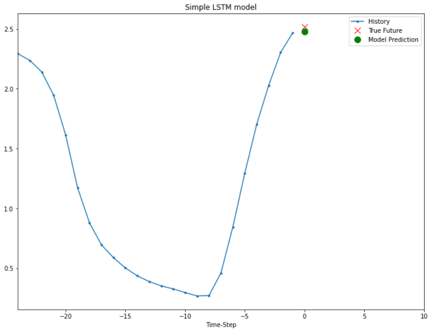
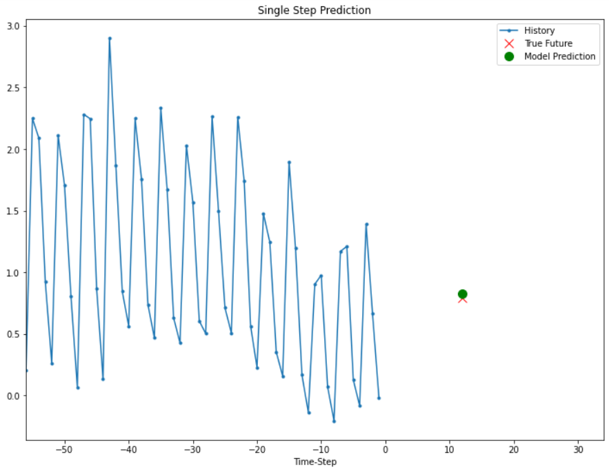
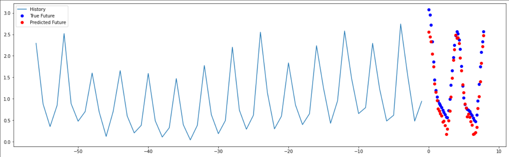

# Climate-Analysis
Project for the course Data Analytics - UE20CS312

## Introduction

Exploratory data analysis on South Indian weather data obtained from the NASA POWER project and forecast of temperature in Chennai. Temperature forecast was carried out using LSTM and GRU models.

## Model performance

|Model |MAPE(%) |RMSE|
|---------------|-----------|--------|
|LSTM for single-step forecast |0.32 |0.13|
|LSTM for single-step forecast using multi-variate data |2.36 |0.13|
|LSTM for multi-step forecast using multi-variate data |2.46 |0.84|

The LSTM model for single-step forecast predicted temperature 1 hour into the future using temperature history from the last 24 hours. It had an MAPE value of 0.32% and RMSE value of 0.13.

The LSTM model for single-step forecast using multi-variate data predicted temperature of a single point 12 hours into the future using temperature history from the last 14 days. It had an MAPE value of 2.36% and RMSE value of 0.13.

The LSTM model for multi-step forecasts using multi-variate data predicted temperature of all points 48 hours into the future using temperature history from the last 14 days. It had an MAPE value of 2.46% and RMSE value of 0.84.

## References
1. Zaytar, Mohamed Akram, and Chaker El Amrani. "Sequence to sequence weather forecasting with long short-term memory recurrent neural networks." International Journal of Computer Applications 143, no. 11 (2016): 7-11
2. Hayati, Mohsen, and Zahra Mohebi. "Application of artificial neural networks for temperature forecasting." International Journal of Electrical and Computer Engineering 1, no. 4 (2007): 662-666.
3. Abhishek, Kumar, M. P. Singh, Saswata Ghosh, and Abhishek Anand. "Weather forecasting model using artificial neural network." Procedia Technology 4 (2012): 311-318.
4. Salman, Afan Galih, Yaya Heryadi, Edi Abdurahman, and Wayan Suparta. "Single layer & multi-layer long short-term memory (LSTM) model with intermediate variables for weather forecasting." Procedia Computer Science 135 (2018): 89-98.
5. Han, Jung Min, Yu Qian Ang, Ali Malkawi, and Holly W. Samuelson. "Using recurrent neural networks for localized weather prediction with combined use of public airport data and on-site measurements." Building and Environment 192 (2021): 107601.
6. http://colah.github.io/

## Contributions

1. 
3. 
4. Rachitha Suresh
